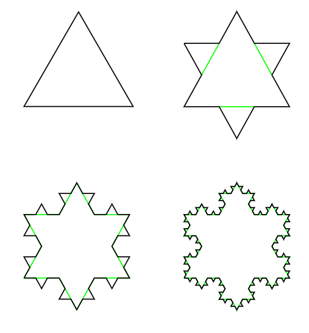

# Learn Python in a Fun Way with Turtle Graphics and Fractals 

> **This course is also available in [Russian](README.ru.md)**. However, Russian translation is not completed at the moment, so use it at your own risk.

Welcome to an Introduction to Python with Turtle Graphics and Fractals! In this course, we will introduce you to main concepts of **Computer Programming** using one of the most popular programming languages today - **Python**. You will also learn to make computer  draw nice pictures - like the one below:

**Computer programming** is a way to tell computer to do things. For example, you can ask computer to calculate the product of all number from 1 to 10. To do that, you need to express your instructions in a clear way, and in a language understandable by a computer. We will learn the language called **Python**, but there are also other popular languages, such as C#, C++ or Javascript.

In this course we will use a technology called **Jupyter Notebooks**. Notebooks are documents that combine normal text with some computer code that you can **execute**. While you can read notebooks here by following the links, to execute them you need some programming environment. There are several ways you can execute notebooks and follow this course:

* **Install Python and Jupyter on your computer**. It is a good idea to do so if you are serious about learning programming. I typically recommend to start with [miniconda](https://conda.io/en/latest/miniconda.html), but you can also install [Anaconda](https://anaconda.org/), or [official Python distribution](https://www.python.org/downloads/) 
* Use [GitHub Codespaces](https://github.com/features/codespaces). Currently you need to apply for early access to this technology, which may take time. 
* Use **Binder** by clicking on the button at the top of this page.

## Content of the Course

| Unit | Link |
|------|------|
| [Introduction to Programming](english/1_Introduction.ipynb) |  |
| [Functions](english/2_Functions.ipynb) |  |
| [Conditional Operators](english/3_Conditional.ipynb) |  |
| [Loops](english/4_Loops.ipynb) |  |
| [Nested Loops](english/5_NestedLoops.ipynb) |  |
| [While Loop](english/6_WhileLoop.ipynb) |  |
| [Recursion and Beauty of Programming](english/7_RecursionAndBeauty.ipynb) |  | 

## Intro Video

<iframe width="560" height="315" src="https://www.youtube.com/embed/BJ1gAnJiPJo" title="YouTube video player" frameborder="0" allow="accelerometer; autoplay; clipboard-write; encrypted-media; gyroscope; picture-in-picture" allowfullscreen></iframe>
